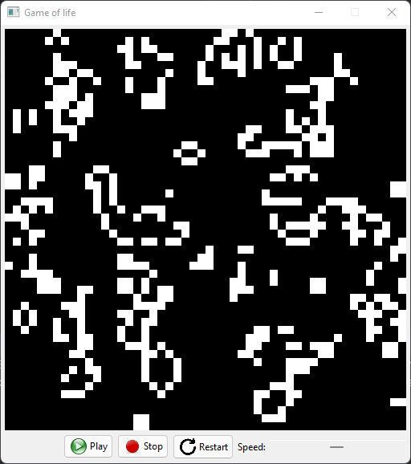

# Game of Life

<br>
This is a conway's game of life simulation with a gui that's made with SWT. In the game you can set the speed of the game reset it and stop/play the simulation.
<br>
## building and starting the project:
If you want to build and start your project you have to look that you use the correct library for SWT in the pom.xml file. For building just use the ```mvn install``` command
